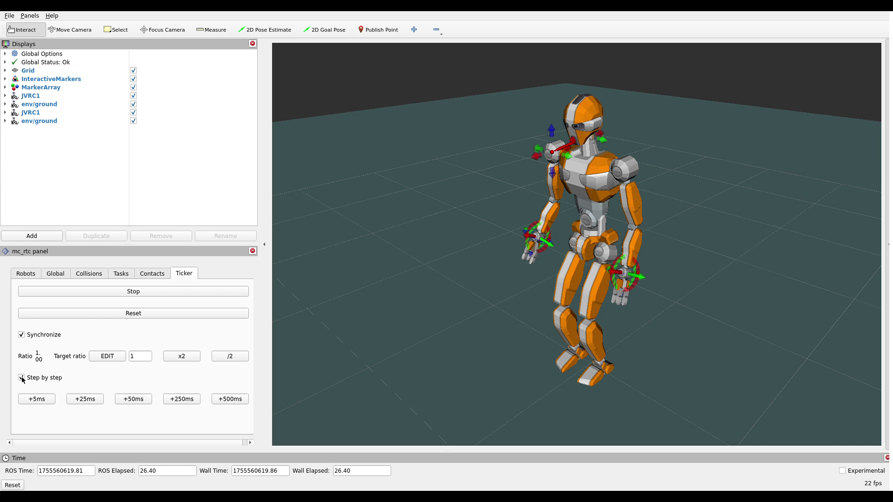

Simple Humanoid Controller
==

This is a simple controller example for the JCVR1 robot using [mc_rtc](https://github.com/jrl-umi3218/mc_rtc.git) framework. 

The controller achieves the following:

1. The left-hand moves to (0.5, 0.25, 1.1) with orientation (0, 0.7, 0, 0.7) (w, x, y, z)
2. The left-hand moves back to its initial position
3. The right-hand moves to (0.5, -0.25, 1.1) with orientation (0, 0.7, 0, 0.7)
4. The right-hand moves back to its initial position
5. Both hands move to their respective specified position
6. Both hands go back to their initial position
7. Repeat

While a single hand is moving, the robot looks at the moving hand. When both hands are moving, the robot looks forward.

[](media/demo.mp4)

Requirements
--
- [mc_rtc](https://github.com/jrl-umi3218/mc_rtc.git)
  - [mc_rtc_superbuild](https://github.com/mc-rtc/mc-rtc-superbuild.git) is provided with mc_rtc. "It will clone, update, build, install all of mc_rtc dependencies, mc_rtc itself and downstream projects."
- RViZ: This is technically preinstalled by mc_rtc_superbuild. However, if you are cloning from the link above, you will need to turn on ROS support
    ```json
    // .\CMakePresets.json
    "WITH_ROS_SUPPORT": "ON"
    ```
- X11
  - Linux/Ubuntu: Ubuntu LTS should already come bundled with X11. Other distributions of Linux should also come with it pre-installed; if not, install it using your package manager.
  - Macos: Install [XQuartz](https://www.xquartz.org/) and [set it up](https://gist.github.com/cschiewek/246a244ba23da8b9f0e7b11a68bf3285)
  - Windows: Install [VcXsrv](https://sourceforge.net/projects/vcxsrv/). Run XLaunch:
    - Following step 1 in this [link](https://medium.com/@potatowagon/how-to-use-gui-apps-in-linux-docker-container-from-windows-host-485d3e1c64a3)
    - OR Use the provided [etc\config.xlaunch](etc\config.xlaunch)

RViZ and X11 are not required if you are using other methods for visualization. 

### Windows

If you are on Windows, you can use `jammy` container from this [repository](https://github.com/phamthekhang632/mc-rtc-superbuild). There are some adjustments to make the installation smoother. You still need to install VcXsrv.

Usage
--

*The following instructions assume you are using `mc_rtc_superbuild` in a devcontainer.*

Configure `git`

```bash
git config --global user.name "Full Name"
git config --global user.email "your.email@provider.com"
```

After installing `mc_rtc_superbuild`, clone this repository in `extensions` 
```bash
cd extensions
git clone https://github.com/phamthekhang632/simple_humanoid_controller.git
```

Building `mc_rtc` environment

```bash
cd ..
cmake --preset relwithdebinfo
```

Build the projects

```bash
cmake --build --preset relwithdebinfo -j
```

Open RViZ

```bash
source /home/vscode/workspace/install/setup_mc_rtc.sh
ros2 launch mc_rtc_ticker display.launch
```

In another terminal, running controller

```bash
source /home/vscode/workspace/install/setup_mc_rtc.sh
mc_rtc_ticker -f extensions/simple_humanoid_controller/etc/SimpleHumanoidController.in.yaml
```

You should have a working controller and its visualization similar to the demo.
For more instructions on how to install `mc_rtc`, please refer to the [official website](https://jrl.cnrs.fr/mc_rtc/tutorials/introduction/installation-guide.html) or [mc_rtc_superbuild](https://github.com/mc-rtc/mc-rtc-superbuild.git) GitHub repo.

For more options, you can run `mc_rtc_ticker --help`

```bash
$ mc_rtc_ticker --help                                                                        
mc_rtc_ticker options:
  --help                           Show this help message
  -f [ --mc-config ] arg           Configuration given to mc_rtc
  -S [ --step-by-step ]            Start the ticker in step-by-step mode
  --run-for arg                    Run for the specified time (seconds)
  -s [ --no-sync ]                 Synchronize ticker time with real time
  -r [ --sync-ratio ] arg          Sim/real ratio for synchronization purpose
  -l [ --replay-log ] arg          Log to replay
  -m [ --datastore-mapping ] arg   Mapping of log keys to datastore
  -g [ --replay-gui-inputs-only ]  Only replay the GUI inputs
  -c [ --continue-after-replay ]   Continue after log replay
  -e [ --exit-after-replay ]       Exit after log replay
  --replay-outputs                 Enable outputs replay (override controller)
```

